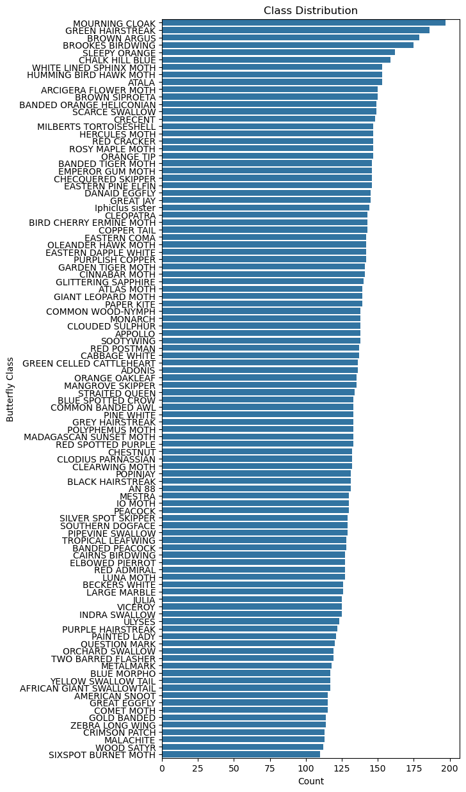

# Using Image Classification to classify species of butterflies

There are 100 differnt classes of butterflies and moths.

# Using ResNet pretrained ImageNet model to perform image classification
Ensured overfitting and underfitting problem by implementing early stopping.

# Results

Classification Report:
                            precision    recall  f1-score   support

         SOUTHERN DOGFACE     0.7273    0.7273    0.7273        11
                  APPOLLO     0.9167    0.7333    0.8148        15
                  MONARCH     0.6316    1.0000    0.7742        12
          IPHICLUS SISTER     0.8824    0.9375    0.9091        16
                 POPINJAY     0.9231    1.0000    0.9600        12
              RED CRACKER     0.9231    0.7500    0.8276        16
          ZEBRA LONG WING     1.0000    1.0000    1.0000        10
         PIPEVINE SWALLOW     0.8750    0.8750    0.8750         8
           MOURNING CLOAK     0.8929    0.9259    0.9091        27
                   ADONIS     0.3600    1.0000    0.5294         9
              RED POSTMAN     1.0000    0.7857    0.8800        14
           ORANGE OAKLEAF     1.0000    0.9286    0.9630        14
        TROPICAL LEAFWING     0.7500    0.7059    0.7273        17
               PINE WHITE     1.0000    0.9286    0.9630        14
            SLEEPY ORANGE     1.0000    0.7368    0.8485        19
                GREAT JAY     0.7727    0.8947    0.8293        19
          GREY HAIRSTREAK     0.7500    0.5294    0.6207        17
       CHECQUERED SKIPPER     0.8824    1.0000    0.9375        15
            QUESTION MARK     0.8571    0.4000    0.5455        15
            CRIMSON PATCH     1.0000    0.8462    0.9167        13
             LARGE MARBLE     0.5000    0.5833    0.5385        12
               PAPER KITE     1.0000    1.0000    1.0000        13
   MILBERTS TORTOISESHELL     1.0000    0.7619    0.8649        21
                    JULIA     1.0000    0.8750    0.9333         8
          ELBOWED PIERROT     0.9091    1.0000    0.9524        10
          ORCHARD SWALLOW     0.8333    0.7895    0.8108        19
       EASTERN PINE ELFIN     0.8571    0.8571    0.8571        14
         MANGROVE SKIPPER     0.8571    0.7500    0.8000         8
                    AN 88     1.0000    1.0000    1.0000        15
              BLUE MORPHO     0.8889    0.6667    0.7619        12
              RED ADMIRAL     0.7778    0.8750    0.8235        16
            CABBAGE WHITE     0.8235    0.8235    0.8235        17
 BANDED ORANGE HELICONIAN     0.8571    0.9231    0.8889        13
      SILVER SPOT SKIPPER     0.8000    0.5714    0.6667         7
                SOOTYWING     0.5000    1.0000    0.6667        13
       RED SPOTTED PURPLE     0.6000    0.8571    0.7059         7
             GREAT EGGFLY     0.8333    0.5000    0.6250        10
                MALACHITE     1.0000    0.7500    0.8571         8
              GOLD BANDED     0.6667    0.8571    0.7500         7
        COMMON BANDED AWL     0.8462    0.7333    0.7857        15
             PAINTED LADY     0.7500    0.8571    0.8000         7
          CLOUDED SULPHUR     0.7500    0.7059    0.7273        17
          PURPLISH COPPER     0.6250    0.5556    0.5882        18
                  CRECENT     1.0000    0.8333    0.9091        12
                  PEACOCK     1.0000    1.0000    1.0000         8
           SCARCE SWALLOW     0.7778    1.0000    0.8750        14
     EASTERN DAPPLE WHITE     0.7500    0.9474    0.8372        19
        BLUE SPOTTED CROW     0.9091    0.7143    0.8000        14
         BLACK HAIRSTREAK     0.9167    0.6875    0.7857        16
              COPPER TAIL     0.6250    0.3571    0.4545        14
      YELLOW SWALLOW TAIL     1.0000    0.8667    0.9286        15
                CLEOPATRA     0.7500    0.9000    0.8182        10
       CLODIUS PARNASSIAN     0.7778    0.7778    0.7778         9
           BANDED PEACOCK     0.8333    0.8333    0.8333        12
          CAIRNS BIRDWING     0.9167    1.0000    0.9565        11
            INDRA SWALLOW     1.0000    0.8889    0.9412         9
                  VICEROY     0.8889    0.6667    0.7619        12
       TWO BARRED FLASHER     0.6923    0.8182    0.7500        11
               WOOD SATYR     0.8000    0.8889    0.8421         9
           STRAITED QUEEN     1.0000    0.5000    0.6667        10
               ORANGE TIP     1.0000    1.0000    1.0000         4
            BECKERS WHITE     0.8824    0.7895    0.8333        19
           AMERICAN SNOOT     0.7000    0.8750    0.7778         8
        PURPLE HAIRSTREAK     0.4167    0.4545    0.4348        11
                    ATALA     0.9000    0.9474    0.9231        19
                   ULYSES     0.8889    0.6667    0.7619        12
                METALMARK     0.6190    1.0000    0.7647        13
                   MESTRA     0.6154    0.8000    0.6957        10
 GREEN CELLED CATTLEHEART     0.7000    0.7000    0.7000        10
            DANAID EGGFLY     0.8235    0.7778    0.8000        18
                 CHESTNUT     0.8824    1.0000    0.9375        15
AFRICAN GIANT SWALLOWTAIL     1.0000    1.0000    1.0000         8
        COMMON WOOD-NYMPH     1.0000    0.7778    0.8750         9
             EASTERN COMA     0.4000    0.6154    0.4848        13
           BROWN SIPROETA     0.9375    0.7143    0.8108        21

                 accuracy                         0.8062       975
                macro avg     0.8296    0.8106    0.8070       975
             weighted avg     0.8343    0.8062    0.8079       975
